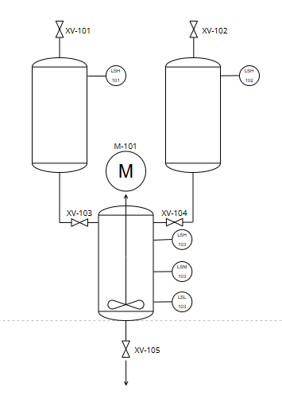
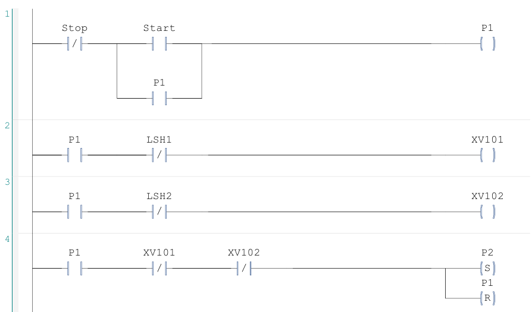
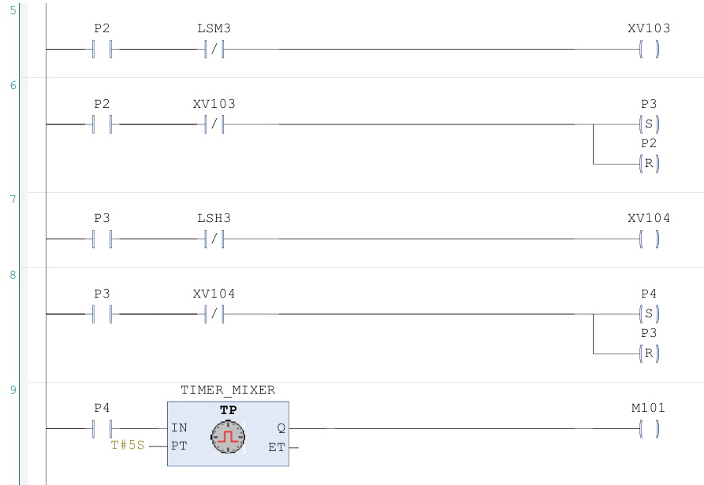
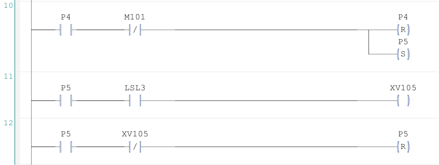

# Proceso de Mezcla de Líquidos Controlado por PLC

## Descripción general

Este proyecto implementa el control automático de un proceso de **mezcla de líquidos** mediante un **PLC**, simulando una operación típica de entornos industriales como:

- Industria alimentaria  
- Industria química  
- Procesos de bebidas  
- Sistemas batch  

El sistema permite controlar el llenado, mezcla y gestión del proceso de forma automatizada, garantizando **repetibilidad, eficiencia y control del proceso**.

---

## Objetivos del proyecto

- Diseñar un sistema de control secuencial para mezcla de líquidos  
- Implementar lógica de control en PLC (tipo Ladder)  
- Simular el comportamiento del proceso industrial  
- Integrar sensores y actuadores típicos de planta  
- Documentar el sistema mediante esquemas  

---

## Descripción del proceso

El sistema modela un proceso típico de mezcla:

1. Precarga del Liquido A
2. Precarga del Liquido B
1. Ingreso de líquido A al tanque de mezclado
2. Ingreso de líquido B al tanque de mezclado
3. Control de nivel en tanque  
4. Proceso de mezcla (agitador)  
5. Descarga del producto final  

El control se basa en lógica secuencial, donde cada etapa depende del estado del sistema (niveles, tiempos o condiciones).

---

## Arquitectura del sistema

El sistema está compuesto por:

### Sensores
- Sensor de nivel mínimo  
- Sensor de nivel máximo  

### Actuadores
- Electroválvulas de entrada (líquido A y B)  
- Motor agitador  
- Válvula de descarga  

### Control
- PLC programado en lógica Ladder  

Su interconexion se muestra en el siguiente diagrama P&ID:

---

## Logica del sistema

El esquema completo del sistema se encuentra en el archivo PDF del repositorio:

📄 `Esquema_Proceso_Mezcla.pdf`

- Lógica general del sistema  

---

## Lógica de control

El proceso sigue una secuencia automática:

1. Llenado del Tanque 1 con el Liquido A hasta alcanzar el nivel maximo
2. Llenado del Tanque 2 con el Liquido B hasta alcanzar el nivel maximo 
3. Llenado del Tanque 3 con líquido A hasta alcanzar el nivel definido (50%)
4. Llenado del Tanque 3 con líquido B hasta el nivel maximo  
5. Activación del agitador por tiempo determinado
6. Descarga del tanque final 

---

## Autor
Diseñado por Emanuel Décima  
Contacto: emanueldecima3@gmail.com  
Marzo 2025